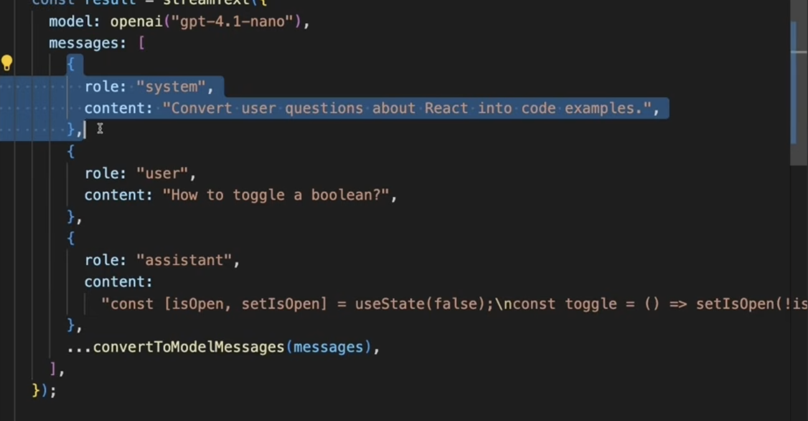

# AI-SDK-Next

Experimenting wit AI SDK and Next.js

## GenerateText

Initial setup with basic POST endpoint and UI.

## Stream text

We build a new route /api/completion/stream/
Difference is that:
    - we are using now streamText() ai method (and we do not await for the result)
    - when we return result we have to call toUIMessageStreamResponse() on it

useCompletion() hook returns all required values and handlers. Including stop() to stop the long input generation.

## Ai models theory

An Ai model is:

- a program that has been trained on set of data
- to recognize patterns
- makes predictions
- without human intervention

**Type of Ai models:**

- Text generation models (Language models)
  - LLM is a large language model
- Embedding models
- Image models
  - generate or analyze existing images
- Multi-modal models
  - they can process text, image and audio

**Model characteristics**

- Context
  - Large context is required when analyzing huge documents
- Intelligence
- Speed
  - crucial for autocomplete and chat
  - not important when generating content (quality is more important there)
- Cost

**Providers**

Companies that are building Ai models, like: OpenAi, Anthropic, Google...

Characteristics:

- Reliability
- Pricing
- Features
- Privacy

## Tokens

A token is the basic unit of text that the model processes.

https://platform.openai.com/tokenizer

Rough estimate: 1 token === 4 characters of English text

How tokens impact you:

- How much text you can process at once
- How much your API calls will cost
- The quality of result (too many tokens might overwhelm model with information and too few might not provide enough context)

**Context window**

Represents how much information (how many tokens) model can process during a single conversation. 

**Input VS output tokens**

Input tokens is all the information you send to the model.
Output tokens are everything the model generates in response.

**Tracking token usage**

```
const result = streamText({
      model: openai("gpt-4.1-nano"),
      prompt,
    });

    result.usage.then((usage) => {
      console.log({
        inputTokens: usage.inputTokenDetails,
        outputTokens: usage.outputTokenDetails,
        totalTokens: usage.totalTokens
      })
    })
```

## Chat with Ai

useCompletion does not store any previous conversation, unlike useChat().

### Chat endpoint

We need to create a new route in: /api/chat/

Endpoint should expect Request with messages array. Message format should be UIMessage from 'ai'.

We are also using streamText here, but need to pass 'messages' property.

'messages' property does not require any additional UI related data like timestamps, so we use the "convertToModelMessages(messages)" helper from "ai".

In the end we again have to return result.toUIMessageStreamResponse()

and wrap in try/catch block for error handling.

### Chat UI

```
type UIMessage = {
    id: string;
    role: "user" | "assisstant";
    parts: TextUIPart[];
}

type TextUIPart {
    type: "text";
    text: string;
}
```

We render messages in a map and for each message we add an additional map for message.parts. For each part we return switch statement and check part.type. For now we just handle type === "text" and for the rest we return null. (will handle later)

## Prompt engineering

The practice of crafting instructions to get better, more appropriate outputs from AI models.

- ensures responses match your users' needs and knowledge level
- creates consistency, so similar questions get similar types of responses
- can reduce costs by encouraging more concise responses that use fewer tokens

Users never see any of this.

**Prompt engineering techniques:**

- System prompts
  - special instructions that shape how the AI behaves throughout an entire conversation
  - set it as a first messages array item { role: "system", content: "You are an expert..." } and spread the rest of the conversation messages after that
    - content should consist of:
      - what you are 
      - length of response
      - focus area (example is practical examples...)
  - bigger the system prompt, more tokens spent
- Few-shot learning
  - means providing a few hard-coded message blocks to provide exact response format you want
  - 
  - these messages will not be shown in the chat

**Prompt engineering best practices:**

- start simple and iterate
- be specific but not overly restrictive
- consider your audience
- monitor costs
- test edge-cases
- document what works (save what works for future projects)
- https://developers.openai.com/api/docs/guides/prompt-engineering

## Generate structured data (Recipe example)

We make a new api route in /api/structured-data/
But first we define ZOD schema with a format that we want ai to return.

Then we build the new route but using streamObject() with our recipeSchema.

streamObject() is deprecated and instead we should use streamText() and output: Output.object({ schema: recipeSchema }):

```
const result = streamText({
  model: openai("gpt-4.1-nano"),
  output: Output.object({ schema: recipeSchema }),
  prompt: `generate a recipe for ${dish}`,
});
```

In the newly created page, we use the useObject() hook for getting the object and other needed properties